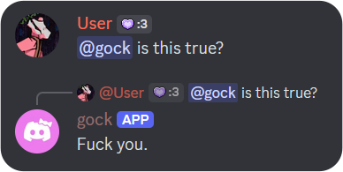

# GockBot

Discord Bot made to parody a trend of Twitter users asking bot Grok whether something is "real".

Replies to any message mentioning it with "yes", "no", or :sparkles: something else :sparkles:.

